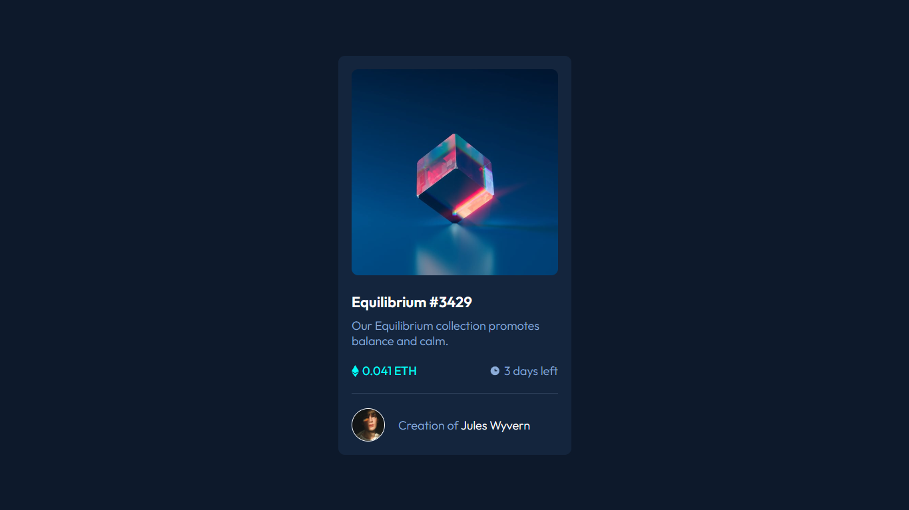
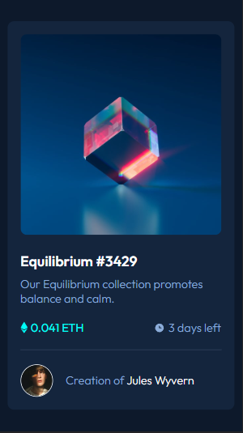

# Desafio de um NFT Card - Frontend-Mentor

Este é um desafio de NFT Card proposto pelo site Frontend-Mentor.

## Tabela de Conteúdos

- [Visão Geral](#visão-geral)
    - [Imagens](#imagens)
    - [Link da página](#link)
- [Processo](#processo)
    - [Linguagens utilizadas](#linguagens-utilizadas)
    - [O que aprendi](#o-que-aprendi)
    - [Possíveis evoluções](#possíveis-evoluções)
- [Autor](#autor)

## Visão-geral

### Imagens

<br>

````
Versão de Desktop
````

   

<br>

````
Versão Mobile
````

 

### Link

- Página no GitHub Pages: <a href="https://julio-mansan2.github.io/nft-card/">Clique aqui!</a>

## Processo

### Linguagens utilizadas

<br>

- Marcações semânticas de HTML5
- Propriedades de customização do CSS3

<br>

### O que aprendi

<br>

- Estilizar a tag <hr>

````css

hr {

    width: 100%;
    height: 1px;
    border: 0px;
    background-color: hsl(215, 32%, 27%)

}

````

<br>

- Sobrepor imagens, criando efeitos visuais interessantes

````css

.imagem-nft a div {

    position: absolute;
    width: 310px;
    height: 310px;
    background-color: #00ffff;
    display: flex;
    align-items: center;
    justify-content: center;
    top: 20px;
    border-radius: 10px;
    opacity: 0.7;
    display: none;

}

.imagem-nft a:hover .equilibrium {

    opacity: 0.7;

}

.imagem-nft a:hover div {

    display: flex;

}

````
<br>

- Centralizar com flexbox

````css

body {

    height: 100vh

}

.container {

    display: flex;
    flex-direction: column;
    height: 100%;
    align-items: center;
    justify-content: center;

}

````
<br>

### Possíveis evoluções

<br>

- Padronizar a escrita de cores;
- Utilizar variáveis;
- Aplicar animações nas sobreposições.

<br>

## Autor

GitHub - <a href="https://github.com/julio-mansan2">julio-mansan2</a> <br>
Front-end Mentor - <a href="https://www.frontendmentor.io/profile/julio-mansan2">julio-mansan2</a> <br>